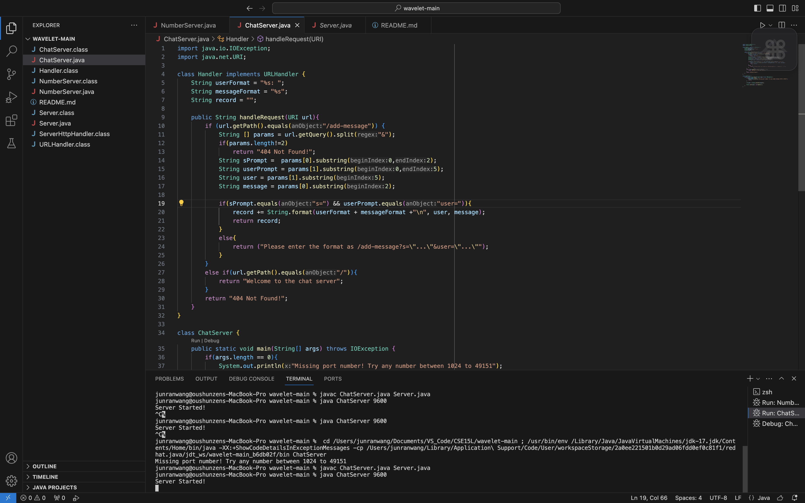
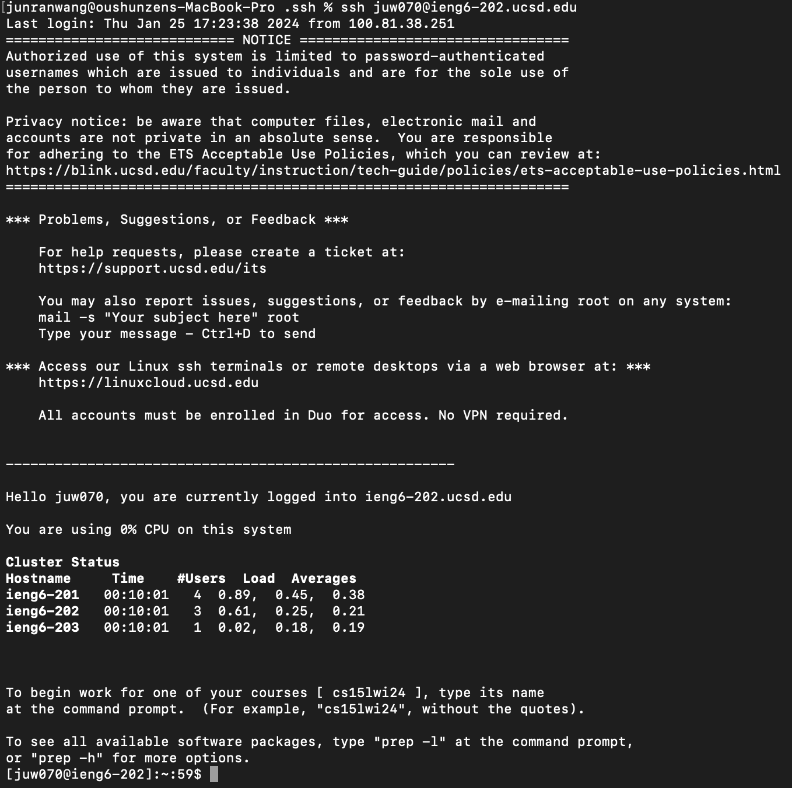

ChatServer Browser
==================

***
ChatServerCode
--------------

***

After using `javac` to compile the **ChatServer.java** and the **Server.java** file, I then used `java ChatServer 9600` to call the main method under **class ChatServer**.
The main method then checks the length, type, and content of the arugment from the terminal input in order to determine if the program should proceed to start the server. 
Once the server is started, I typed `http://localhost:9600/add-message?s=Hello&user=jpolitz` in order to visualize the function of the ChatServer. Once the terminal argument is consider as acceptable, the main method will call the method in **Server.java** which will then call the *handleRequest* method with the URL, `http://localhost:9600/add-message?s=Hello&user=jpolitz`, as the pass in parameter in **ChatServer.java**. There are 3 class fields in the **class Handler**, 2 String format field, `userFormat = "%s: "` and `messageFromat = "%s"`for printing the conversation message, and 1 empty string, `record`, to record all the conversations. The `if` statment will check the path of the url and see if it is in the desired format `/add-message`, else the web page will print "404 Not Found!". In this case we pass the `if` statment. Then the String array `params` will store the 2 query that are separated by "&", and if the length of the query is not 2, print "404 Not Found!" on the web page. In this case, the `params` has stored `{s=Hello, user=jpolitz}`. The next 4 String variables tends to store the information in the query. `sPrompt` will store `s=`, `userPromot` will store `user=`, `user` will store `jpolitz`, and `message` will store `Hello`. The next `if `block checks that if the previous 4 String variables store the correct corresponding value in it. In this case, we pass the `if` statement. Then the program add the conversation into `record` with the desired String format by using the pre-defined class field of String format, `userFormat` and `messageFromat`. Then return this record of the conversation on the web page. If the `if` statement failed, the program will inform the user about the desired format by printing an sample format on the web page. 
***

The second picture follows very similar process as the first one, the Server envokes *handleRequest* and pass in `http://localhost:9600/add-message?s=Hi&user=jason` as the argument. Then the `if` statement will check if the path of the url meet the format requirement. We pass the check. `params` has stored something different this time, `{s=Hi, user=jason}`. The next `if` checks whether the length of params is 2. We pass the check. This time, 2 of the 4 String variable to store something that is different than the first example. `sPrompt` will store `s=`, `userPromot` will store `user=`, `user` will then store `jason`, and `message` will then store `Hi`. After checking `sPrompt` and `userPrompt` have meet the requirement in the `if` statement, the program starts concating the output together in `record`. Since `record` is a class field, it will be updated/appended with new content. The `\n` in record switch to a new line every time we store something new in record. After returning `record` the web page will show the previous conversation and the conversation we just made.
***

The absolute path of private key is `/Users/junranwang/.ssh/id_rsa`
***

The abosulte path of public key is `/home/linux/ieng6/oce/3k/juw070/.ssh/authorized_keys`
***

***

I didn't have any knowledge prior taking lab 2 and lab 3. Everything I did is new to me.
