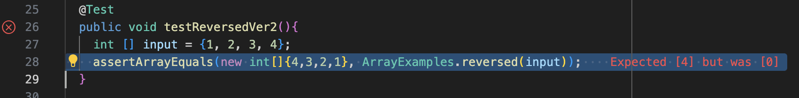
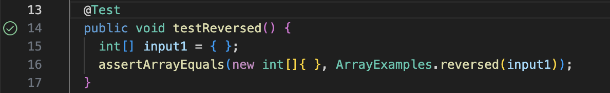

Bugs and Commands
=================

Failure-inducing input
----------------------

```
  @Test
  public void testReversedVer1(){
    int [] input = {1, 2, 3};
    assertArrayEquals(new int[]{3,2,1}, ArrayExamples.reversed(input));
  }
```

None failure-inducing input
---------------------------
```
  @Test
  public void testReversed() {
    int[] input1 = { };
    assertArrayEquals(new int[]{ }, ArrayExamples.reversed(input1));
  }
```

***

The Symptoms
------------





***

Before
------
```
static int[] reversed(int[] arr) {
    int[] newArray = new int[arr.length];
    for(int i = 0; i < arr.length; i += 1) {
      arr[i] = newArray[arr.length - i - 1];
    }
    return arr;
  }
```

After
-----
```
static int[] reversed(int[] arr) {
    int[] newArray = new int[arr.length];
    for(int i = 0; i < arr.length; i += 1) {
      newArray[i] = arr[arr.length - i - 1];
    }
    return newArray;
  }
```
JUnit says that the first element in the returned array when ArrayExamples called revered method with input as the argument is different from the expected value. The value is expected to be 3 but the actual value in the 0 index of the newArray is actually {0, 0, 0}. The statement inside the for loop needs to be changed. Instead of assigning the element in newArray to arr and then returning arr, we want to assign values in arr to  newArray, then simply return newArray.

***
Using ```man grep``` to figure out the possible command for ```grep```
----------------------------------------------------------------------

```
NAME
     grep, egrep, fgrep, rgrep, bzgrep, bzegrep, bzfgrep, zgrep, zegrep, zfgrep – file pattern searcher

SYNOPSIS
     grep [-abcdDEFGHhIiJLlMmnOopqRSsUVvwXxZz] [-A num] [-B num] [-C[num]] [-e pattern] [-f file] [--binary-files=value] [--color[=when]] [--colour[=when]]
          [--context[=num]] [--label] [--line-buffered] [--null] [pattern] [file ...]

DESCRIPTION
     The grep utility searches any given input files, selecting lines that match one or more patterns.  By default, a pattern matches an input line if the regular
     expression (RE) in the pattern matches the input line without its trailing newline.  An empty expression matches every line.  Each input line that matches at
     least one of the patterns is written to the standard output.

     grep is used for simple patterns and basic regular expressions (BREs); egrep can handle extended regular expressions (EREs).  See re_format(7) for more
     information on regular expressions.  fgrep is quicker than both grep and egrep, but can only handle fixed patterns (i.e., it does not interpret regular
     expressions).  Patterns may consist of one or more lines, allowing any of the pattern lines to match a portion of the input.

     zgrep, zegrep, and zfgrep act like grep, egrep, and fgrep, respectively, but accept input files compressed with the compress(1) or gzip(1) compression
     utilities.  bzgrep, bzegrep, and bzfgrep act like grep, egrep, and fgrep, respectively, but accept input files compressed with the bzip2(1) compression utility.
```

Source used:
-----------
Terminal manual command ``` man grep ```. I found out this command in the built-in terminal command `man grep`.

***
Using ```grep -m num``` to read the keyword lines in the file for 'num' mathces
-------------------------------------------------------------------

```
     -m num, --max-count=num
             Stop reading the file after num matches.
```
```
junranwang@oushunzens-MacBook-Pro docsearch_lab5 % cd technical 
junranwang@oushunzens-MacBook-Pro technical % cd biomed 
junranwang@oushunzens-MacBook-Pro biomed % grep -m 2 "This" 1471-2091-3-4.txt 
        metallo-β-lactamase. This work describes our efforts on
        on dialysis [ 30 31 32 ] . This organism is inherently
```
This `grep -m 2 "This" 1471-2091-3-4.txt` prints the first two 'This' keyword exist in the 1471-2091-3-4.txt in two lines. It is useful when user only wants to find the first few occurence of the keyword "This" in the file.
```
junranwang@oushunzens-MacBook-Pro docsearch_lab5 % cd technical 
junranwang@oushunzens-MacBook-Pro technical % cd biomed 
junranwang@oushunzens-MacBook-Pro biomed % grep -m 3 "rna" 1468-6708-3-1.txt
          used an alternative approach, which assigns a different
          maximum thickness of the internal carotid artery,
```
This `grep -m 3 "rna" 1468-6708-3-1.txt` prints the first two words in two lines that contains the key 'rna' in it, becasue the third occurence of the keyword does not exist. It is useful when user only wants to find the first few occurence of words that contains the key in the file.

Source used:
-----------
Terminal manual command ``` man grep ```. I found out this command in the built-in terminal command `man grep`.

***
Using ```grep -n``` to read all the keyword lines in the files
--------------------------------------------------------------

```
     -n, --line-number
             Each output line is preceded by its relative line number in the file, starting at line 1.  The line number counter is reset for each file
             processed.  This option is ignored if -c, -L, -l, or -q is specified.
```
```
junranwang@oushunzens-MacBook-Pro biomed % grep -n  "this" 1468-6708-3-1.txt
34:        events [ 10 ] . In this paper we study whether BMI at
94:          For this analysis we defined YHL as the number of
101:          drawback of this simple definition of 'healthy' is that
146:          this analysis is based.
159:          plus the grand mean. The mean of this new variable, for a
173:          required to detect an effect of this magnitude is
242:        with 20-24.9 in all comparisons. For this reason, and to
257:        YOL, but this group was not significantly different from
362:          significant in this patient group.
370:          10% of the sample, but results with and without this
395:          persons, but we think this is unlikely given the absence
```
This `grep -n  "this" 1468-6708-3-1.txt` command prints all of the lines that contains the keyword 'this', with the line number on the left side of the output. This is useful when user want to see where are all the 'this' keyword located in the text file.
```
junranwang@oushunzens-MacBook-Pro biomed % grep -n  "rna" 1468-6708-3-1.txt
104:          used an alternative approach, which assigns a different
140:          maximum thickness of the internal carotid artery,
```
This `grep -n  "this" 1468-6708-3-1.txt` command prints all of the lines that contains the keyword who has 'rna' in the word, with the line number on the left side of the output. This is useful when user want to see where are all the words that contains 'rna' keyword located in the text file.

Source used:
-----------
Terminal manual command ``` man grep ```. I found out this command in the built-in terminal command `man grep`.

***
Using ```grep -c``` to count the number of lines in the files that contains the keyword
---------------------------------------------------------------------------------------

```
          -c, --count
             Only a count of selected lines is written to standard output.
```
```
junranwang@oushunzens-MacBook-Pro biomed % grep -c "this"  1468-6708-3-1.txt      
11
```
This `grep -c "this"  1468-6708-3-1.txt` command shows that there exists 11 lines that contains the keyword 'this' in this file. This is useful when the user only wants to know how many lines in the file contains the keyword 'this'.
```
junranwang@oushunzens-MacBook-Pro biomed % grep -c "rna"  1468-6708-3-1.txt
2
```
This `grep -c "rna"  1468-6708-3-1.txt` command shows that in this file exists 2 lines that contain the word who has 'rna' in it. This is useful when the user only wants to know how many lines in the file contains the word who has 'rna' key in it.

Source used:
-----------
Terminal manual command ``` man grep ```. I found out this command in the built-in terminal command `man grep`.

***
Using ```grep -A num``` to read addtional following 'num' lines after each keyword mathch
-----------------------------------------------------------------------------------------

```
     -A num, --after-context=num
             Print num lines of trailing context after each match.  See also the -B and -C options.
```
```
junranwang@oushunzens-MacBook-Pro biomed % grep -A 3 "this"  1468-6708-3-1.txt
        events [ 10 ] . In this paper we study whether BMI at
        baseline is associated with living longer, and/or with more
        years of being healthy, in a cohort of older adults for
        whom risk factors, subclinical disease, and morbidity are
--
          For this analysis we defined YHL as the number of
          years (of 7) in which a person reported excellent, very
          good, or good health (were 'healthy'). YHL ranges from 0
          (for persons who were never in excellent, very good, or
--
          drawback of this simple definition of 'healthy' is that
          it does not distinguish between fair or poor health and
          death, since all are considered 'not healthy'. We also
          used an alternative approach, which assigns a different
--
          this analysis is based.
        
        
          Analysis
--
          plus the grand mean. The mean of this new variable, for a
          group of subjects, is the adjusted mean YOL for that
          group. Adjusted YHL was calculated in a similar manner.
          We calculated two sets of adjusted variables because of
--
          required to detect an effect of this magnitude is
          proportional to the inverse of the squared effect size,
          large effect sizes are desirable.
        
--
        with 20-24.9 in all comparisons. For this reason, and to
        increase sample size for those with low BMI, we combined
        the two lower categories, defining underweight as a BMI
        under 20.
--
        YOL, but this group was not significantly different from
        the normal group, in part because of low sample size. Men
        classified as normal, overweight or obese all had about the
        same YOL.
--
          significant in this patient group.
        
        
          Potential limitations
--
          10% of the sample, but results with and without this
          group were similar. Analysis of mean YOL instead of the
          more traditional survival analysis survival analysis was
          appropriate here, since virtually no persons were lost to
--
          persons, but we think this is unlikely given the absence
          of any differences in EVGFP.
```
This `grep -A 3 "this"  1468-6708-3-1.txt` command prints the lines that contain the keyword 'this' in the file, followed by the next 3 lines after each target line. This is useful for user who wants to not only find the location of the key but also find the interpretation of the key in the context by checking the content of the next 3 lines.
```
unranwang@oushunzens-MacBook-Pro biomed % grep -A 2 "rna"  1468-6708-3-1.txt
          used an alternative approach, which assigns a different
          value to each level of EVGFP [ 19 ] . Preliminary results
          were similar for the two approaches, however, and we
--
          maximum thickness of the internal carotid artery,
          depression (CESD score), serum albumin, serum
          cholesterol, and serum creatinine. These measures are
```
This `grep -A 2 "rna"  1468-6708-3-1.txt` command prints the lines that contain the word who has 'rna' in it, followed by the next 2 lines after each target line. This is useful for user who wants to not only find the location of the key but also find the interpretation of the key in the context by checking the content of the next 2 lines.

Source used:
-----------
Terminal manual command ``` man grep ```. I found out this command in the built-in terminal command `man grep`.
