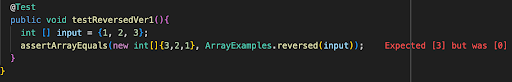
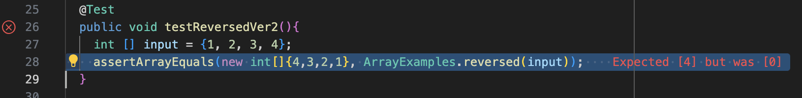

Bugs and Commands
=================
Failure-inducing input
----------------------
```
  @Test
  public void testReversedVer1(){
    int [] input = {1, 2, 3};
    assertArrayEquals(new int[]{3,2,1}, ArrayExamples.reversed(input));
  }
```

None failure-inducing input
---------------------------

```
static int[] reversed(int[] arr) {
    int[] newArray = new int[arr.length];
    for(int i = 0; i < arr.length; i += 1) {
      arr[i] = newArray[arr.length - i - 1];
    }
    return arr;
  }
```

***





***

After
```
static int[] reversed(int[] arr) {
    int[] newArray = new int[arr.length];
    for(int i = 0; i < arr.length; i += 1) {
      newArray[i] = arr[arr.length - i - 1];
    }
    return newArray;
  }
```

