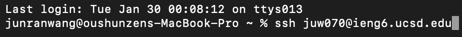
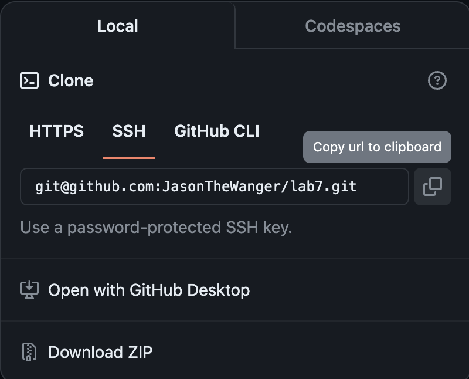
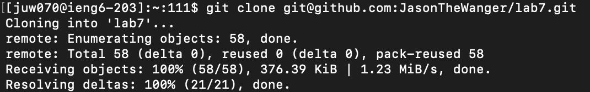
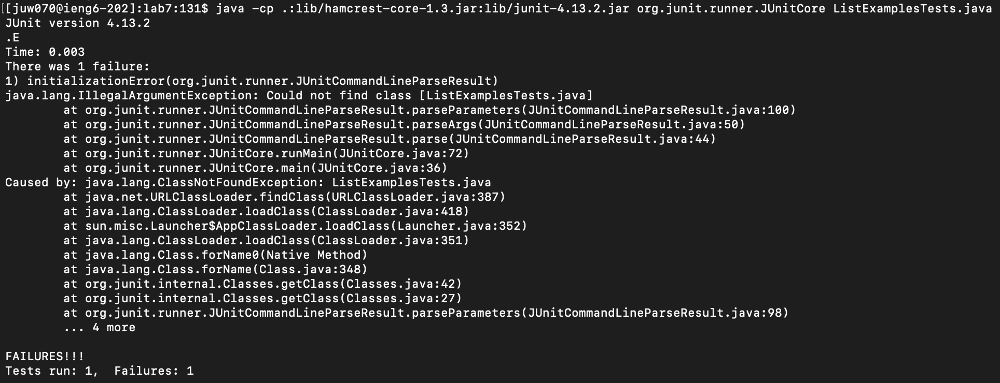
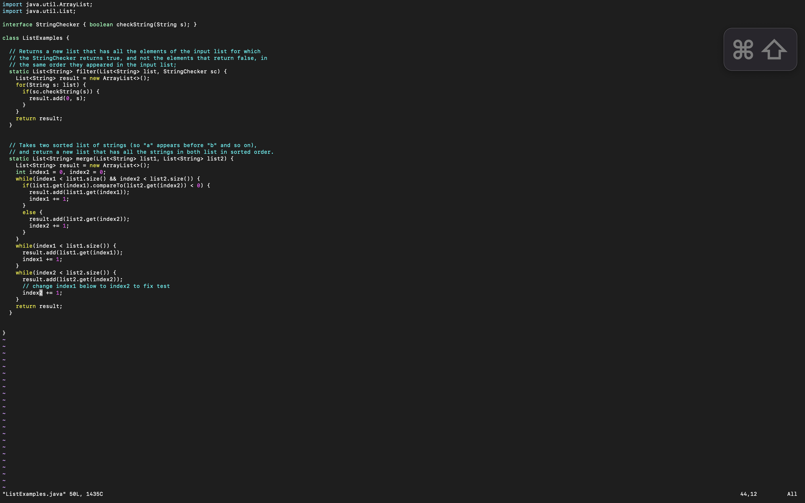
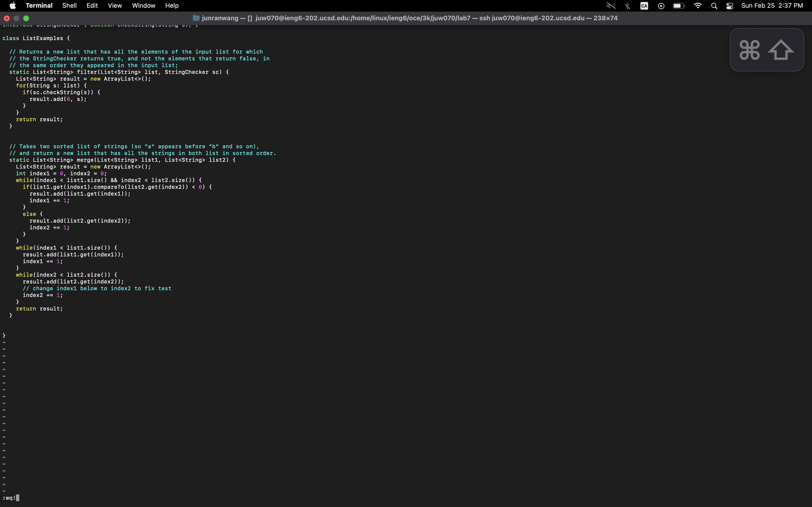
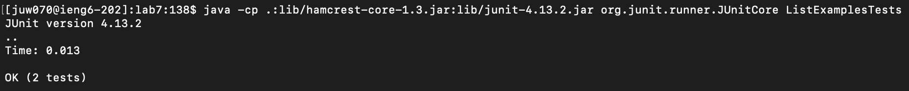
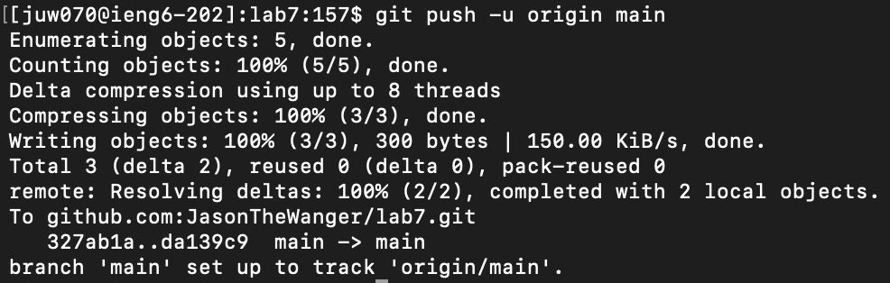
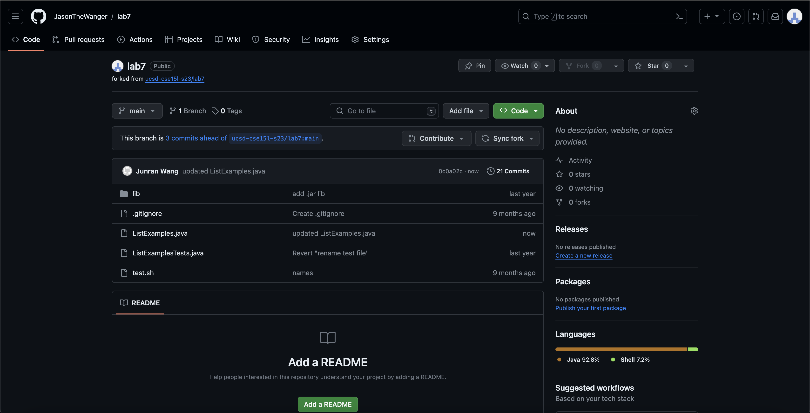
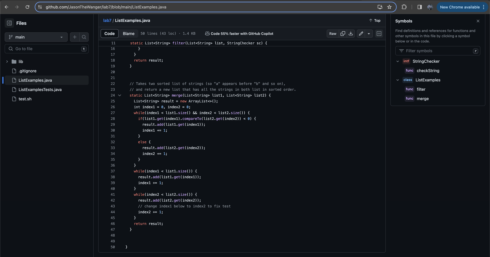

Lab Repot 4 - Vim
=================

Steps 4
-------



Key pressed: ``` ssh juw070@ieng6.ucsd.edu ``` The `ssh` key login in to the ieng6 remote computer 

***

Steps 5
-------


Copy the SSH url by clicking the copy icon

***



Key pressed: ``` git clone <command>v  ``` --> ``` git clone git@github.com:JasonTheWanger/lab7.git ``` I copy the path of the ssh url from my github account then typed ``` git clone ``` and pasted the url after the command. By doing `git clone` ssh url, I can edit the corresponding repository on my computer and able to make update then push it back to my github repository. 

***

Steps 6
-------


Key pressed: ``` cd lab7 ``` Change the current direcotry to _lab7_

***


Key pressed: ``` javac -cp .:lib/hamcrest-core-1.3.jar:lib/junit-4.13.2.jar *.java ``` Compile all java files including the Junit tests

***



Key pressed: ``` java -cp .:lib/hamcrest-core-1.3.jar:lib/junit-4.13.2.jar org.junit.runner.JUnitCore ListExamplesTests``` Run the Junit tests in _ListExamplesTests_

***

Steps 7
-------


Key pressed: ``` vim ListEamples.java ``` After taking notes of the error that the program produces, `vim` into the _ListEamples.java_ file to make edits.

***



Key pressed: ``` :43 <enter> e r2 ``` Bying pressing `:43 <enter>`, allows me to change my cursor position the line 43, which is the line that has bug in it. `e` allows me to change my cursor position to the end of the word __'index1'__. `r2` allows me to replace the character that my cursur is on to number 2. Therefore, this command combo helps me to quickly access to the variable __'index1'__ and change the variable name to __'index2'__.  

***



Key pressed: ``` :wq! <enter> ``` `:wq!` saves any update I've made in the file, and quit `vim` editing mode.

***

Steps 8
-------


Key pressed: ``` <up> <up> <up> <enter> ``` --> ``` javac -cp .:lib/hamcrest-core-1.3.jar:lib/junit-4.13.2.jar *.java ``` The javac command was in the history of the terminal so I typed 3 ```<up>``` key to access the command in the history.

***


Key pressed: ``` <up> <up> <up> <enter> ``` --> ``` java -cp .:lib/hamcrest-core-1.3.jar:lib/junit-4.13.2.jar org.junit.runner.JUnitCore ListExamplesTests ``` The java command was in the history of the terminal so I typed 3 ```<up>``` key to access the command in the history.

***

Steps 9
-------


Key pressed: ``` git add "ListExamples.java" ``` add the updated file to stage changes for the next commit

***


Key pressed: ``` git commit -m "ListExamples.java" ``` create a new commit to the changes of the file with a customized commit message

***



Key pressed: ``` git push -u origin main ``` push the commited file back from my local main branch to the main branch on the remote repository named "origin"
***

GitHub and File Updated Successful
-------------------------



***



***
