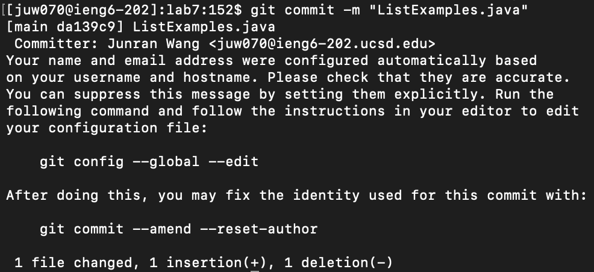

Lab Repot 4 - Vim
=================
Steps 4
-------


Key pressed: ``` ssh juw070@ieng6.ucsd.edu ```
***

Steps 5
-------


Copy the SSH url by clicking the copy icon
***


Key pressed: ``` git clone <command>v  ``` --> ``` git clone git@github.com:JasonTheWanger/lab7.git ``` I copy the path of the ssh url from my github account then typed ``` git clone ``` and pasted the url after the command.
***

Steps 6
-------


Key pressed: ``` cd lab7 ```
***


Key pressed: ``` javac -cp .:lib/hamcrest-core-1.3.jar:lib/junit-4.13.2.jar *.java ```
***


Key pressed: ``` java -cp .:lib/hamcrest-core-1.3.jar:lib/junit-4.13.2.jar org.junit.runner.JUnitCore ListExamplesTests```
***

Steps 7
-------


Key pressed: ``` vim ListEamples.java ```
***


Key pressed: ``` 43j e r2 ```
***


Key pressed: ``` :wq! <enter> ```
***

Steps 8
-------


Key pressed: ``` <up> <up> <up> <enter> ``` --> ``` javac -cp .:lib/hamcrest-core-1.3.jar:lib/junit-4.13.2.jar *.java ``` The javac command was in the history of the terminal so I typed 3 ```<up>``` key to access the command in the history.
***


Key pressed: ``` <up> <up> <up> <enter> ``` --> ``` java -cp .:lib/hamcrest-core-1.3.jar:lib/junit-4.13.2.jar org.junit.runner.JUnitCore ListExamplesTests ``` The java command was in the history of the terminal so I typed 3 ```<up>``` key to access the command in the history.
***

Steps 9
-------


Key pressed: ``` git add "ListExamples.java" ```
***



Key pressed: ``` git commit -m "ListExamples.java" ```
***


Key pressed: ``` git push -u origin main ```
***
