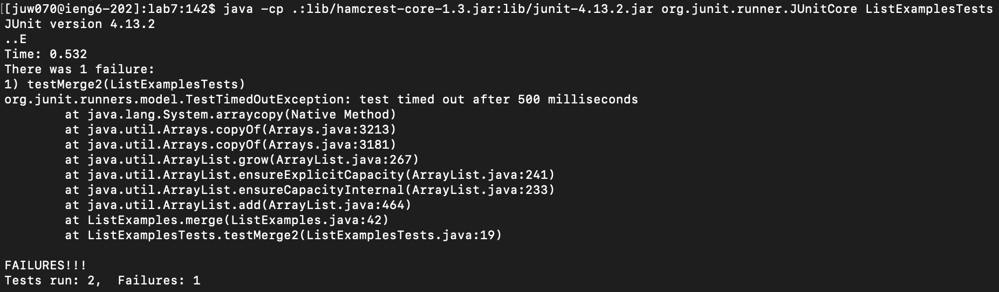

Lab Repot 4 - Vim
=================
Steps 4
-------


Key pressed: ``` ssh juw070@ieng6.ucsd.edu ```
***

Steps 5
-------


Copy the SSH url by clicking the copy icon
***


Key pressed: ``` git clone <command> v  ``` --> ``` git clone git@github.com:JasonTheWanger/lab7.git ```
***

Steps 6
-------


Key pressed: ``` cd lab7 ```
***


Key pressed: ``` javac -cp .:lib/hamcrest-core-1.3.jar:lib/junit-4.13.2.jar *.java ```
***



Key pressed: ``` java -cp .:lib/hamcrest-core-1.3.jar:lib/junit-4.13.2.jar org.junit.runner.JUnitCore ListExamplesTests```
***

Steps 7
-------


Key pressed: ``` vim ListEamples.java ```
***


Key pressed: ``` 43j e r2 ```
***


Key pressed: ``` :wq! <enter> ```
***

Steps 8
-------
![Image](

Key pressed: ``` <up> <up> <up> <enter> ```
