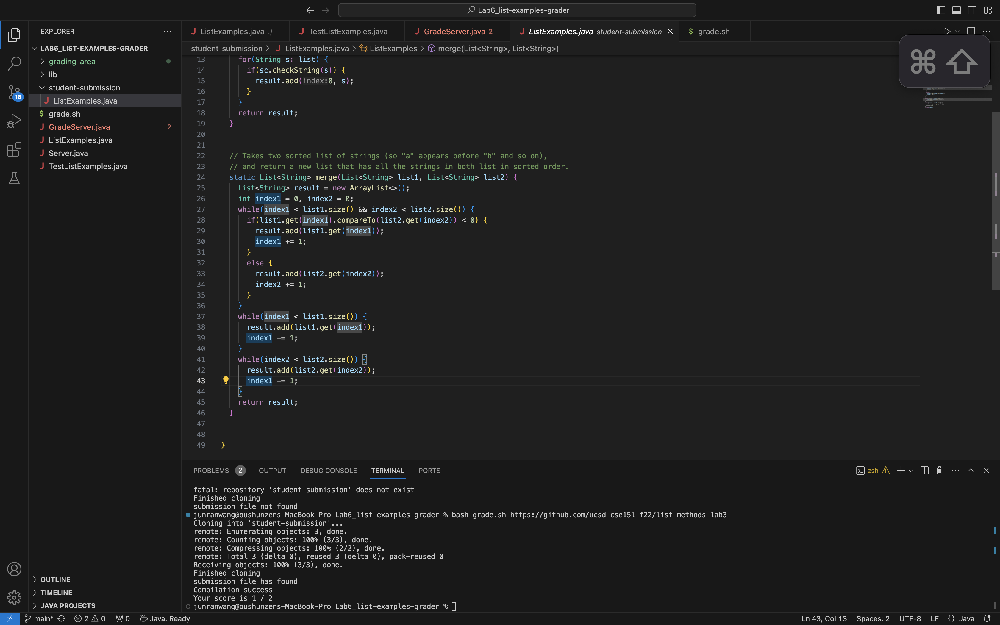
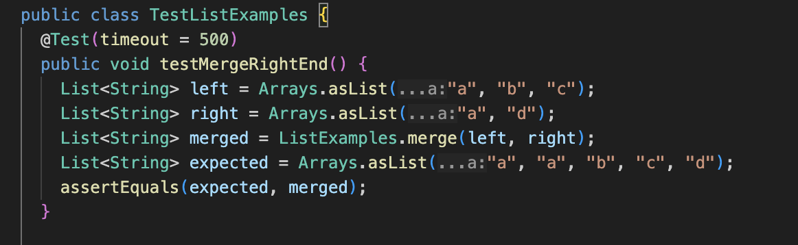
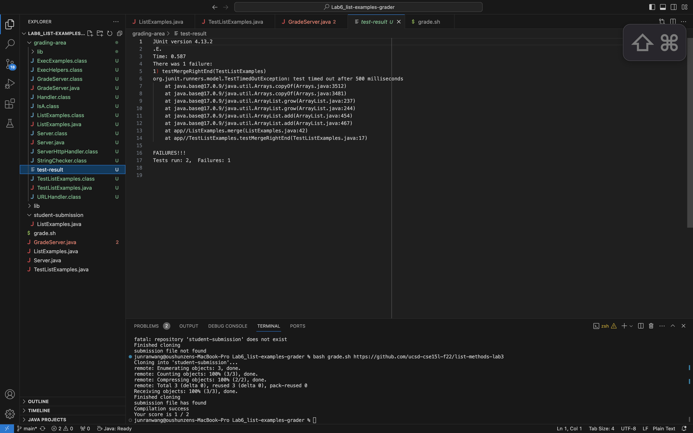
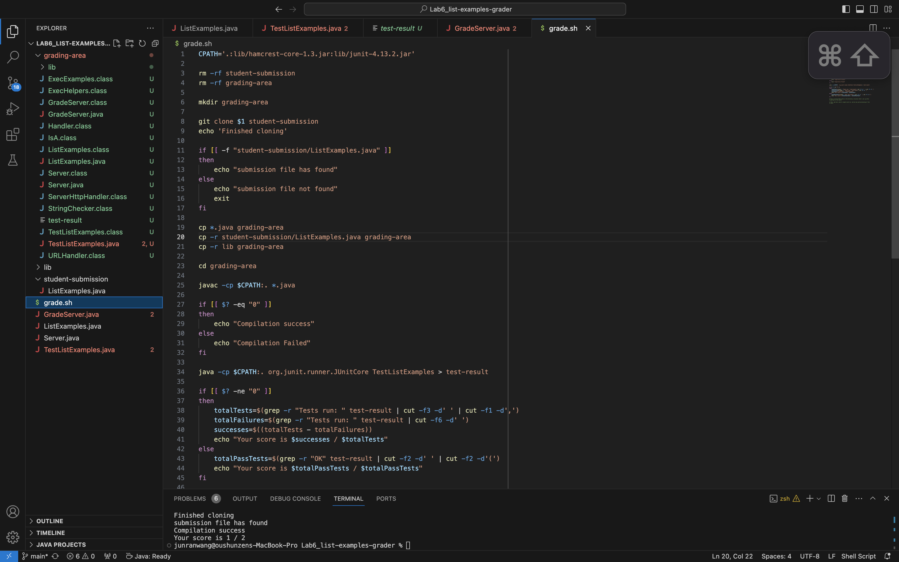
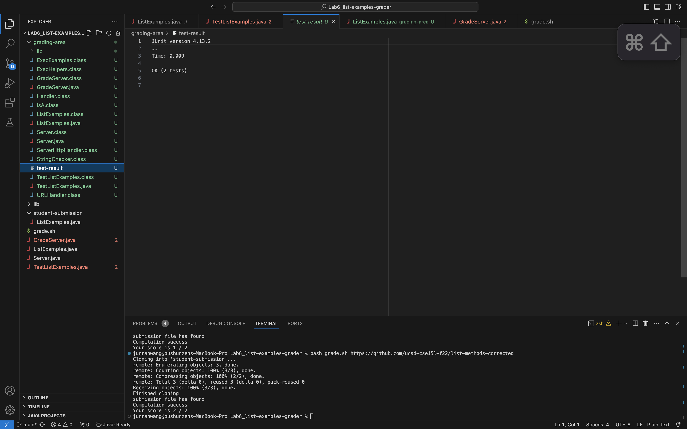
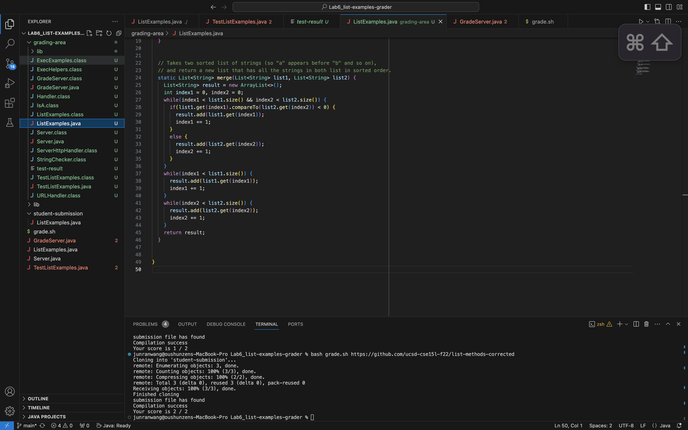

Lab Report 5
============

__Student__: Hi there, I am encountering a coding bug in my ListExamples.java. I wrote my own junit test and got a failure on the test. I will have my code, junit test, junit test result, and my bash script attached below. Can someone help me to explain what is/are the issue with my code? What are the possible ways to address my issue?

__TA__: Looking at your evidence document, your junit tester and bash script are done correctly. However, the reason why you are getting such test failure output is because your program timedout, possibly due to encountering a infinite loop. Double check your loops, check if your conditional variable is being updated accordingly in your ListExamples.java.

__Student__: Thanks for the hint, I've succeessfully found the bug in my code. The bug was cause by the infinity while loop when I was trying to merge the element in the second list into the result list. I updated the wrong variable, index1, instead, I should update index2 since this variable is the conditional variable for this while loop. I fixed this bug in my code and passed the Junit test.

